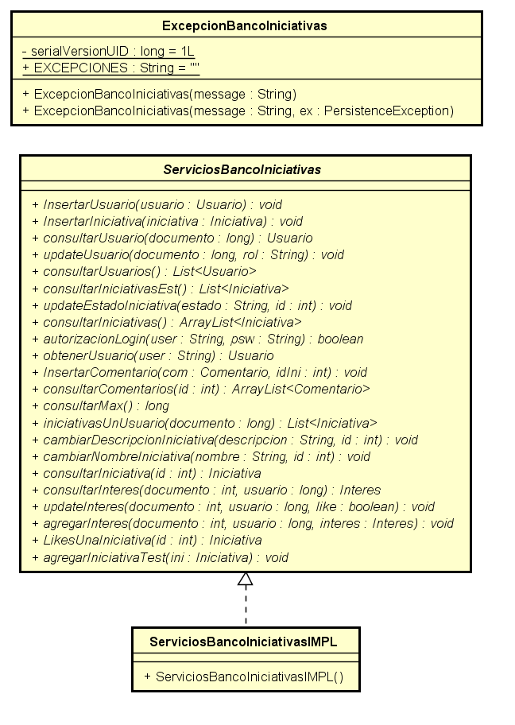

# BANCO DE INICIATIVAS-ECI AVDF 2018-1
### Proceso de Desarrollo de software
## Integrantes
##### Due;o del producto:
* Francisco Jose Chaves Alonso
##### Scrum Master :
* Daniel Alberto Rosales Castro
##### Team:
* Daniel Alberto Rosales Castro
* Valentina Siabatto Rojas
* Andres Camilo Villamil Bustillo
* Fabian Camilo Bohorquez Heredia

## Descripcion del producto
El Banco de Iniciativas es una aplicacion y herramienta en donde los integrantes de la Escuela Colombiana De Ingenieria Julio Garavito seran capaces de de registrar las iniciativas e ideas que posean para poder mejorar la institucion. ## completar

## funcionalidades
#### inicio de sesion

#### perfil del usuario

#### Consultar iniciativas
#### Actualizar estados Iniciativas
#### Registrar iniciativas
#### Busqueda de usuarios
#### Estadisticas generales
#### Exportar

## Arquitectura y Diseño
#### Modelo E-R

####  Diagrama de clases

#### Capa presentacion

#### Capa Logica

