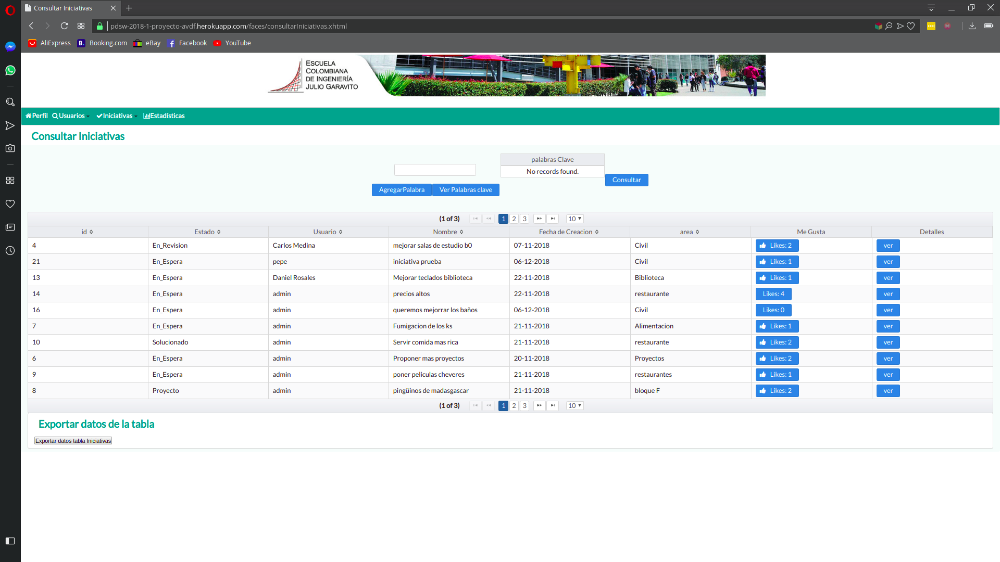
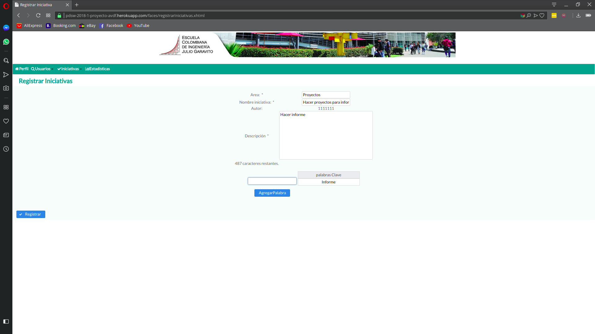
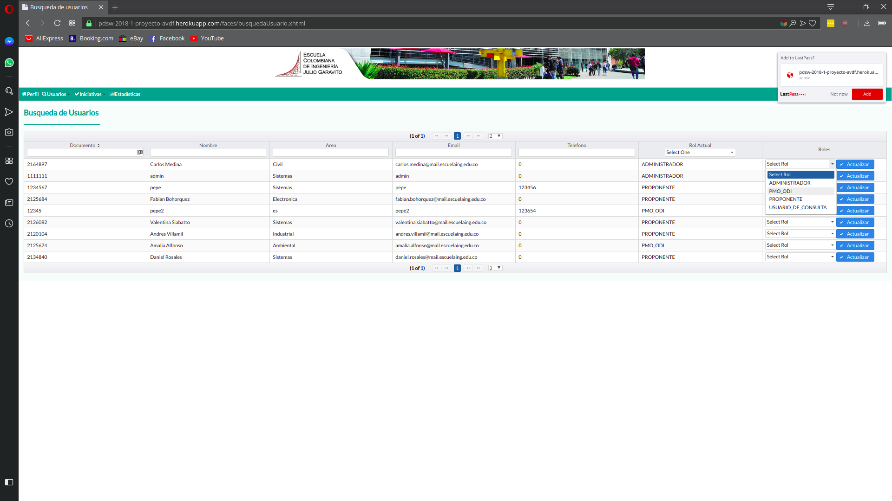
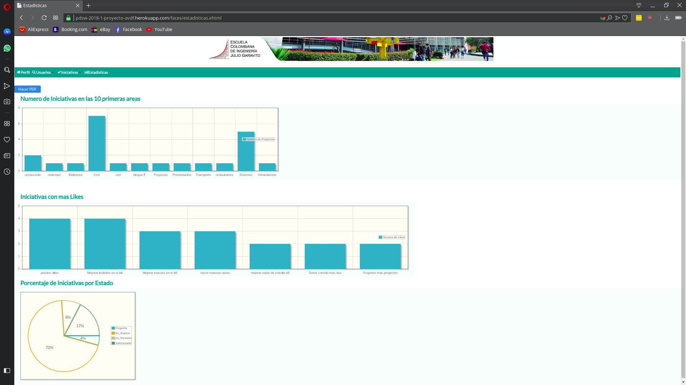
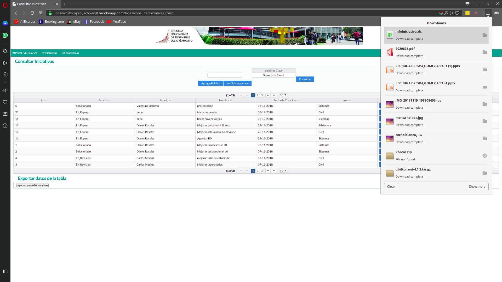
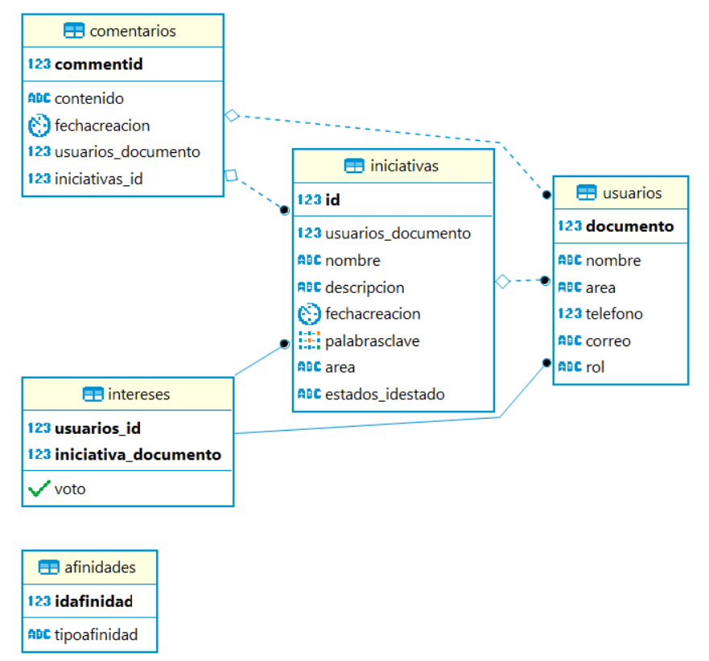
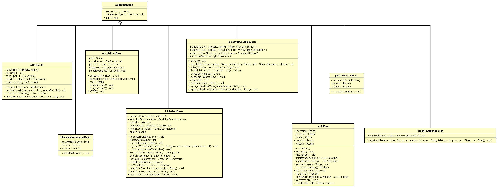
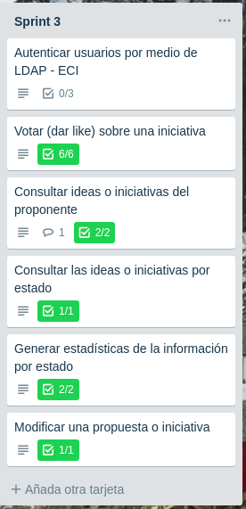

# BANCO DE INICIATIVAS-ECI AVDF 2018-1

### Proceso de Desarrollo de software
## Integrantes
##### Due;o del producto:
* Francisco Jose Chaves Alonso
##### Scrum Master :
* Daniel Alberto Rosales Castro
##### Team:
* Daniel Alberto Rosales Castro
* Valentina Siabatto Rojas
* Andres Camilo Villamil Bustillo
* Fabian Camilo Bohorquez Heredia

## Descripcion del producto
El Banco de Iniciativas es una aplicacion y herramienta en donde los integrantes de la Escuela Colombiana De Ingenieria Julio Garavito seran capaces de registrar las iniciativas e ideas que posean para poder mejorar la institucion. La plataforma permitira registrar iniciativas, tambien generar seguimiento de las iniciativas propias.

## funcionalidades
#### inicio de sesion

#### perfil del usuario

#### Consultar iniciativas

#### Actualizar estados Iniciativas

#### Registrar iniciativas

#### Busqueda de usuarios

#### Estadisticas generales

#### Exportar

## Arquitectura y Diseño
#### Modelo E-R

####  Diagrama de clases

#### Capa presentacion

#### Capa Logica

## tecnologias
Para el desarrollo de la aplicacion se utilizaron las siguientes tecnologias
* **maven**:  herramienta open-source para facilitar el proceso de construccion apartir del codigo fuente
* **myBatis**: herramienta encargada de la persistencia, mappea sentencias SQL y procedimientos almacenados con objetos a partir de ficheros *XML* o anotaciones.
* **Google Guice**: es un *framework* de *inyección de dependencias* que puede ser utilizado en aplicaciones hechas con Java
* **PrimeFaces**: es una biblioteca de componentes para JavaServer Faces de código abierto que cuenta con un conjunto de componentes enriquecidos que facilitan la creación de las aplicaciones web
* **PostgreSQL**:  es un sistema de gestión de bases de datos relacional y de código abierto, publicado bajo la licencia PostgreSQL

## Despliegue en heroku
[Link Banco de iniciativas Heroku](https://pdsw-2018-1-proyecto-avdf.herokuapp.com/faces/Inicio.xhtml)

## Metodologia

Para la realizacion de este proyecto se utilizo el desarrollo por medio de SCRUM, con una duracion de 3 sprints cada uno de 2 semanas.
Como metodologias adicionales se aplico el pair programing e intentar seguir los principos del modelo SOLID

## Backlog
[Link trello backlog](https://trello.com/b/tEOAgJjN/2018-2-proypdsw-vsrb)

##  Sprints
### *Sprint 1*
**Descripcion**:  En el primer Sprint se realizo la estructura necesaria para poder desarrollar la aplicacion. Se practico bastante el pair programing cambiando frecuentemente las parejas de trabajo, al final se logro entregar un producto funcional con todas las historias de usuarios planeadas para este sprint.
Durante este Sprint se mantuvo un trabajo constante en el desarrollo del producto, el constante cambio de parejas y el conocimiento del codigo fuente fue una de las partes clave para poder sacar el este sprint adelante, ya que se cambio el modelo tanto de clases como entidad-relacion bastantes veces

**Sprint backlog**

**Sprint-burndown Chart**
*faltan imagenes*

### *Sprint 2*
**Descripcion**: Durante el segundo Sprint se mantuvo el pair programing constante como en el primer sprint. como ya se tenia la estructura inicial del proyecto que se realizo durante el primer sprint fue mucho mas facil desarrollar las historias de usuario propuestas para este.
En este sprint ya se tenia una parte visual estable y la que se seguiria usando durante el transcurso del sprint y los sprints siguientes.
Se aprovecho bastante el tiempo dando como resultados el buen desarrollo del sprint teniendo incluso dias sobrantes antes de la entrega del producto el cual fue completamente funcional

**Sprint backlog**

**Sprint-burndown Chart**

*faltan imagenes*

### *Sprint 3*
**Descripcion**: Durante el Tercer Sprint se presento como problema la falta de tiempo ya que durante este Sprint se estaban realizando otras actividades academicas en la universidad, por este motivo se redujo un poco el uso de pair programing, a pesar de esto se logro tener las tareas de este sprint a tiempo para el product review con el stakeholder.

**Sprint backlog**

**Sprint-burndown Chart**

### *estadisticas GitHub*
Aqui se muestran las estadisticas que aparencen el el repositiorio de GitHub, Estas abarcan lo que fue del todo el proceso de desarrollo del producto

**Pulso**

**Contribuyentes**

**Commits**

**frecuencia de codigo**

## Reporte de pruebas\

[CircleCi link](https://circleci.com/gh/GrCross/PDSW-2018-1-PROYECTO-avdf/tree/master)

